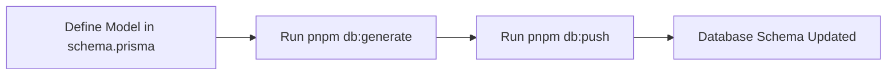
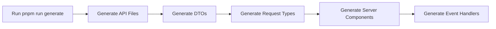
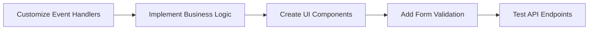

# Development Workflow

This section provides a complete workflow guide showing how to go from database models to working UI forms in the Small Offices Demo project.

## 📋 Table of Contents

- [Overview](#overview)
- [Complete Workflow](#complete-workflow)
- [Step-by-Step Example](#step-by-step-example)
- [Common Patterns](#common-patterns)
- [Troubleshooting](#troubleshooting)

## 🔍 Overview

The development workflow follows this pattern:

1. **Define Database Models** → Prisma schema
2. **Generate Code** → CLI tool creates API files
3. **Implement Business Logic** → Event handlers and repositories
4. **Create UI Forms** → Vue components with validation
5. **Test & Deploy** → End-to-end testing

## 🔄 Complete Workflow

### Phase 1: Database Design



### Phase 2: Code Generation



### Phase 3: Implementation



## 📝 Step-by-Step Example

Let's walk through creating a complete feature from scratch using the **Post** model as an example.

### Step 1: Define the Database Model

**File:** `server/services/prisma/schema.prisma`

```prisma
model Post {
  id        String    @id @default(uuid())
  content   String
  createdAt DateTime  @default(now())
  updatedAt DateTime  @updatedAt
  deletedAt DateTime?
  authorId  String
  author    User      @relation(fields: [authorId], references: [id])
  imageId   String?
  image     Media?    @relation(fields: [imageId], references: [id])
}
```

**Commands:**
```bash
# Generate Prisma client
pnpm db:generate

# Push schema to database
pnpm db:push
```

### Step 2: Generate API Files

**Command:**
```bash
# Generate all files for Post model
pnpm run generate --models Post
```

**Generated Files:**
- `shared/domains/posts/` - DTOs and request types
- `server/domains/posts/` - Models, repositories, event handlers
- `server/api/posts/` - API routes

### Step 3: Review Generated Code

**DTO Definition:**
```typescript
// shared/domains/posts/postDTO.ts
export interface PostDTO {
  author: UserDTO;
  content: string;
  createdAt: Date;
  deletedAt: Date | null;
  id: string;
  image: MediaDTO | null;
  updatedAt: Date;
}
```

**Request Schema:**
```typescript
// shared/domains/posts/storePostRequest.ts
export const StorePostRequestBodySchema = z.object({
  content: z.string(),
  imageId: z.string().nullable().optional(),
});
```

**Event Handler:**
```typescript
// server/domains/posts/storePostEventHandlerFn.ts
export const storePostEventHandlerFn: EventHandlerFn<
  StorePostRequestBody,
  PostDTO
> = async (event) => {
  const { body, user } = event;
  
  const postRepository = new PostRepository(prismaClient);
  const post = await postRepository.create({
    ...body,
    authorId: user.id,
  });

  return PostDTOMapper.toDTO(post);
};
```

### Step 4: Create the UI Form

**File:** `app/pages/posts/create.vue`

```vue
<template>
  <div class="mx-auto w-full max-w-2xl p-3">
    <n-h1>Create a post</n-h1>

    <n-form id="create-post-form">
      <n-form-item
        label="Content"
        required
        v-bind="contentProps"
      >
        <n-input
          v-model:value="content"
          type="textarea"
          show-count
          placeholder="Enter content"
        />
      </n-form-item>

      <n-button
        type="primary"
        :pending="isStorePostPending"
        @click="handleStorePost"
      >
        Publish
      </n-button>
    </n-form>
  </div>
</template>

<script setup lang="ts">
const {
  defineField,
  errors,
  handleSubmit,
  isSubmitting: isStorePostPending,
  resetForm,
  setErrors,
} = useForm({
  initialValues: {
    content: '',
    imageId: null,
  },
  validationSchema: toTypedSchema(StorePostRequestBodySchema),
});

const [content, contentProps] = defineField('content', makeInputProps<string>);

const handleStorePost = handleSubmit(async (values) => {
  try {
    const responseData = await $fetch('/api/posts', {
      body: values,
      method: 'POST',
    });

    resetForm();
    navigateTo(`/posts/${responseData.data.id}`);
  }
  catch (error) {
    handleFetchError(error, t, message, setErrors);
  }
});
</script>
```

### Step 5: Add Internationalization

**File:** `i18n/locales/fr/posts.json`

```json
{
  "create": {
    "title": "Créer un nouveau post"
  },
  "forms": {
    "fields": {
      "content": {
        "label": "Contenu",
        "placeholder": "Écrivez votre contenu ici..."
      }
    },
    "ctas": {
      "publish": "Publier"
    }
  }
}
```

### Step 6: Test the Feature

**Commands:**
```bash
# Start development server
pnpm dev

# Test API endpoint
curl -X POST http://localhost:3000/api/posts \
  -H "Content-Type: application/json" \
  -d '{"content": "Test post"}'
```

## 🔄 Common Patterns

### 1. CRUD Operations

Every model typically needs these operations:

```typescript
// Create
POST /api/posts
// Read (list)
GET /api/posts
// Read (single)
GET /api/posts/:id
// Update
PUT /api/posts/:id
// Delete
DELETE /api/posts/:id
```

### 2. Form Patterns

**Simple Form:**
```vue
<template>
  <n-form>
    <n-form-item label="Field" v-bind="fieldProps">
      <n-input v-model:value="field" />
    </n-form-item>
    <n-button @click="handleSubmit">Submit</n-button>
  </n-form>
</template>
```

**Form with File Upload:**
```vue
<template>
  <n-form>
    <n-form-item label="Content" v-bind="contentProps">
      <n-input v-model:value="content" type="textarea" />
    </n-form-item>
    <n-upload :custom-request="uploadHandler" />
    <n-button @click="handleSubmit">Submit</n-button>
  </n-form>
</template>
```

### 3. Error Handling

```typescript
const handleSubmit = handleSubmit(async (values) => {
  try {
    const response = await $fetch('/api/endpoint', {
      body: values,
      method: 'POST',
    });
    
    // Success handling
    resetForm();
    navigateTo('/success');
  }
  catch (error) {
    // Error handling
    handleFetchError(error, t, message, setErrors);
  }
});
```

### 4. Loading States

```vue
<template>
  <n-button 
    :pending="isSubmitting" 
    :disabled="isUploading"
    @click="handleSubmit"
  >
    {{ isSubmitting ? 'Saving...' : 'Save' }}
  </n-button>
</template>
```

## 🚀 Best Practices

### 1. Model Design

- **Use descriptive names** for models and fields
- **Include standard fields** (`id`, `createdAt`, `updatedAt`, `deletedAt`)
- **Define relationships** clearly
- **Use appropriate field types**

### 2. Code Generation

- **Run generate after schema changes**
- **Review generated files** before customizing
- **Don't edit generated files** directly
- **Extend functionality** through separate files

### 3. Form Implementation

- **Use generated schemas** for validation
- **Implement proper error handling**
- **Add loading states** for better UX
- **Use internationalization** for labels

### 4. Testing

- **Test API endpoints** independently
- **Test form validation** thoroughly
- **Test error scenarios** (network errors, validation errors)
- **Test user flows** end-to-end

## 🛠️ Troubleshooting

### Common Issues

**1. Generated files not found**
```bash
# Solution: Run generate command
pnpm run generate
```

**2. Type errors in forms**
```bash
# Solution: Check imports and generated types
import { StorePostRequestBodySchema } from '~~/shared/domains/posts/storePostRequest';
```

**3. API endpoints not working**
```bash
# Solution: Check event handlers and repositories
# Ensure business logic is implemented correctly
```

**4. Form validation not working**
```bash
# Solution: Verify schema and field definitions
const [field, fieldProps] = defineField('fieldName', makeInputProps<string>);
```

### Debug Commands

```bash
# Check generated files
ls shared/domains/posts/
ls server/domains/posts/
ls server/api/posts/

# Check database
pnpm db:studio

# Check API endpoints
curl http://localhost:3000/api/posts

# Check form validation
# Open browser dev tools and check console
```

## 📚 Related Documentation

- [Database Models](./../database-models/README.md) - Learn about Prisma schema design
- [Code Generation](./../code-generation/README.md) - Understand the CLI tool
- [Form Handling](./../form-handling/README.md) - Master form implementation

## 🔗 Quick Reference

### Commands

```bash
# Database
pnpm db:generate    # Generate Prisma client
pnpm db:push        # Push schema to database
pnpm db:seed        # Seed database with test data

# Code Generation
pnpm run generate   # Generate API files for all models
pnpm run generate --models Post User  # Generate for specific models

# Development
pnpm dev            # Start development server
pnpm build          # Build for production
pnpm preview        # Preview production build
```

### File Structure

```
├── server/services/prisma/schema.prisma  # Database models
├── shared/domains/{model}/               # Generated DTOs and types
├── server/domains/{model}/               # Generated server components
├── server/api/{model}/                   # Generated API routes
└── app/pages/{model}/                    # UI components
```

### Key Imports

```typescript
// Form validation
import { useForm } from 'vee-validate';
import { toTypedSchema } from '@vee-validate/zod';

// Generated types
import { StorePostRequestBodySchema } from '~~/shared/domains/posts/storePostRequest';

// Utilities
import { makeInputProps } from '~~/app/utils/forms/makeInputProps';
import { handleFetchError } from '~~/app/utils/responses/handleFetchError';
``` 